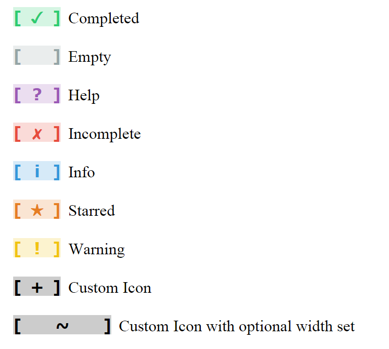

# taskchars
**taskchars** is a simple Javascript utility for creating HTML character entity based icons including a default set of icons specifically made for task/todo lists.

## Installation
Include taskchars in the head section of your HTML document:

	

## Task Icons

### Usage
Simply call the `TaskIcons` object to return an HTML string containing the formatted icon:

	TaskIcons.complete; // [ ✓ ]

## Custom Icons
Creating icons is simple as well.  

### Custom Icon
Create a new instance of the `TaskIcon` object.  The first parameter is the icon's color and the second is the html string to use for the icon:

	var icon = new TaskIcon( '#000', '+' ).buildIconHTML();

### Custom Icon (with additional options)
2 additional values you can edit for the new icon include the class name and the width:

	var icon = new TaskIcon( '#000', '~', 'new-class', 80 ).buildIconHTML();

## Available Icons
This is the preview of the avaliable icons in the script.

## About
This script serves as my first venture into using both Git for source control and Github as an web-based gallery for my various projects.  I also specifically made this script to help create an icon library suitable for use within Google App Scripts without having to import images and do a lot of extra unnecessary work.  

If you like the script or have any comments or suggestions, feel free to contact me.
